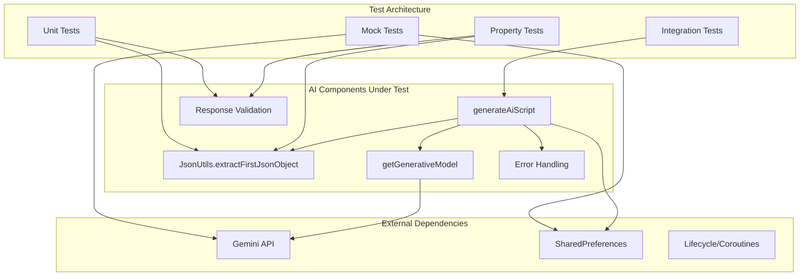

# Design Document: GooneeBrowser AI Testing Framework

## Overview

This design outlines a comprehensive testing framework for the AI functionality in GooneeBrowser. The testing framework will address the current reliability issues in the AI Tool Builder by providing systematic unit tests, integration tests, and property-based tests for all AI-related components. The design focuses on testing the JSON parsing logic, API integration, error handling, and user interaction flows.

## Architecture

The testing architecture follows a layered approach that mirrors the AI functionality structure:



### Testing Strategy Layers

1. **Unit Tests**: Test individual components in isolation
2. **Integration Tests**: Test component interactions and workflows
3. **Property Tests**: Test universal properties across input ranges
4. **Mock Tests**: Test external API interactions with controlled responses

## Components and Interfaces

### JsonUtils Testing Interface

```kotlin
interface JsonUtilsTestable {
    fun extractFirstJsonObject(raw: String?): String?
}
```

**Test Responsibilities:**
- Validate JSON extraction from various text formats
- Handle edge cases like nested objects, escaped strings
- Ensure null safety and error resilience

### AI Script Generator Testing Interface

```kotlin
interface AiScriptGeneratorTestable {
    suspend fun generateAiScript(idea: String): AiGenerationResult
    fun validateApiKey(key: String): ApiKeyValidation
    fun parseAiResponse(response: String): ParsedAiResponse
}

data class AiGenerationResult(
    val success: Boolean,
    val name: String?,
    val script: String?,
    val explanation: String?,
    val error: AiError?
)

data class ApiKeyValidation(
    val isValid: Boolean,
    val errorMessage: String?
)

data class ParsedAiResponse(
    val name: String,
    val script: String,
    val explanation: String,
    val isValid: Boolean
)

sealed class AiError {
    object NetworkError : AiError()
    object ApiKeyError : AiError()
    object SafetyError : AiError()
    object JsonParseError : AiError()
    data class UnknownError(val message: String) : AiError()
}
```

### Mock Interfaces for Testing

```kotlin
interface MockGenerativeModel {
    suspend fun generateContent(prompt: String): MockResponse
}

data class MockResponse(
    val text: String?,
    val shouldThrowException: Boolean = false,
    val exceptionType: ExceptionType = ExceptionType.NETWORK
)

enum class ExceptionType {
    NETWORK, SAFETY, API_KEY, TIMEOUT, UNKNOWN
}
```

## Data Models

### Test Data Models

```kotlin
data class AiTestCase(
    val name: String,
    val input: String,
    val expectedOutput: ExpectedAiOutput,
    val shouldSucceed: Boolean
)

data class ExpectedAiOutput(
    val name: String?,
    val script: String?,
    val explanation: String?,
    val errorType: AiError?
)

data class JsonTestCase(
    val name: String,
    val input: String?,
    val expectedOutput: String?,
    val shouldExtract: Boolean
)

data class ApiKeyTestCase(
    val name: String,
    val apiKey: String,
    val isValid: Boolean,
    val expectedError: String?
)
```

### Test Configuration Models

```kotlin
data class MockApiConfiguration(
    val responses: Map<String, MockResponse>,
    val defaultDelay: Long = 100L,
    val shouldSimulateNetworkIssues: Boolean = false
)

data class TestEnvironment(
    val mockApi: MockApiConfiguration,
    val testPreferences: Map<String, Any>,
    val enableLogging: Boolean = true
)
```

## Correctness Properties

*A property is a characteristic or behavior that should hold true across all valid executions of a system—essentially, a formal statement about what the system should do. Properties serve as the bridge between human-readable specifications and machine-verifiable correctness guarantees.*

Based on the prework analysis, here are the consolidated correctness properties:

### Property 1: JSON Extraction Robustness
*For any* text input containing valid JSON (with or without markdown formatting, surrounding text, nested objects, or escaped strings), the JSON extractor should successfully extract the first complete JSON object while preserving content integrity.
**Validates: Requirements 1.1, 1.2, 1.3, 1.4**

### Property 2: JSON Extraction Safety
*For any* text input containing malformed JSON or no JSON objects, the JSON extractor should return null gracefully without throwing exceptions.
**Validates: Requirements 1.5, 1.6**

### Property 3: Response Validation and Defaults
*For any* AI response (valid or missing fields), the script generator should validate required fields and provide meaningful defaults for missing or empty name, script, and explanation fields.
**Validates: Requirements 2.1, 2.2, 2.3, 2.4, 2.5**

### Property 4: JavaScript Validation
*For any* AI response containing JavaScript code, the script generator should detect invalid syntax and handle errors appropriately.
**Validates: Requirements 2.6**

### Property 5: API Key Validation
*For any* API key format (valid or invalid), the system should correctly validate the key format and provide appropriate error messages for malformed keys.
**Validates: Requirements 3.2, 3.4, 3.5**

### Property 6: Preset Consistency
*For any* preset prompt selection or sequence, the AI tool builder should generate consistent output formats and handle each preset independently while maintaining functionality across all supported languages.
**Validates: Requirements 6.1, 6.2, 6.3, 6.4, 6.5**

### Property 7: Script Processing Normalization
*For any* AI-generated script with different formatting styles, markdown blocks, multiple JSON objects, syntax variations, or comments, the script generator should normalize output and extract clean functional code.
**Validates: Requirements 7.1, 7.2, 7.3, 7.4, 7.5**

### Property 8: Comprehensive Error Handling
*For any* error scenario (JSON parsing, API errors, generation failures, consecutive failures), the error handler should provide user-friendly messages, appropriate retry options, error classification, warnings for invalid scripts, troubleshooting suggestions, and sufficient logging context.
**Validates: Requirements 8.1, 8.2, 8.3, 8.4, 8.5, 8.6**

### Property 9: Resource Cleanup
*For any* cancellation scenario during AI generation, the script generator should properly clean up resources and dismiss dialogs regardless of the cancellation timing.
**Validates: Requirements 9.3**

### Property 10: Loading State Management
*For any* failure scenario during AI generation, the error handler should dismiss loading dialogs before showing error messages.
**Validates: Requirements 9.5**

### Property 11: Sandbox Integration
*For any* AI-generated script, the system should properly mark scripts for sandbox evaluation, provide human-readable explanations, display both code and explanation during preview, mark approved scripts as trusted, and provide fallback descriptions for inadequate explanations.
**Validates: Requirements 10.1, 10.2, 10.3, 10.4, 10.5**

## Error Handling

The testing framework will comprehensively test error handling across multiple failure scenarios:

### Network Error Handling
- **Connection Timeouts**: Simulate network timeouts during API calls
- **Service Unavailability**: Mock API service unavailable responses (503, 502)
- **Rate Limiting**: Test API rate limit exceeded scenarios (429)
- **SSL/TLS Errors**: Simulate certificate validation failures
- **DNS Resolution**: Test DNS resolution failure scenarios

### API Error Handling
- **Authentication Failures**: Test invalid, expired, or revoked API keys
- **Safety Filter Violations**: Test content blocked by Gemini safety filters
- **Malformed Requests**: Test API request format validation
- **Response Parsing**: Test handling of unexpected API response formats

### Application Error Handling
- **JSON Parsing Failures**: Test malformed JSON responses from AI
- **JavaScript Validation**: Test invalid JavaScript syntax detection
- **Resource Cleanup**: Test proper cleanup on cancellation or failure
- **State Management**: Test UI state consistency during error scenarios

### Error Recovery Strategies
- **Retry Logic**: Test automatic retry for transient failures
- **Fallback Mechanisms**: Test default value provision for missing data
- **User Feedback**: Test error message clarity and actionability
- **Logging**: Test error context preservation for debugging

## Testing Strategy

### Dual Testing Approach

The testing strategy employs both unit tests and property-based tests as complementary approaches:

**Unit Tests Focus:**
- Specific error scenarios and edge cases
- Integration points between components
- UI behavior validation
- Mock API response handling
- Specific examples of success/failure cases

**Property Tests Focus:**
- Universal properties across all input ranges
- JSON extraction robustness across all valid inputs
- Response validation across all possible AI outputs
- Error handling consistency across all failure types
- Comprehensive input coverage through randomization

### Property-Based Testing Configuration

**Framework Selection:** Kotest Property Testing for Kotlin
- Minimum 1000 iterations per property test (due to AI response variability)
- Custom generators for JSON, API responses, and error scenarios
- Shrinking support to find minimal failing examples

**Test Tagging Format:**
Each property test must include a comment referencing the design property:
```kotlin
// Feature: goonee-ai-testing, Property 1: JSON Extraction Robustness
```

### Test Categories

#### 1. JsonUtils Unit Tests
```kotlin
class JsonUtilsTest {
    // Property tests for extraction robustness
    // Unit tests for specific edge cases
    // Error handling validation
}
```

#### 2. AI Script Generation Integration Tests
```kotlin
class AiScriptGeneratorTest {
    // Mock API integration tests
    // End-to-end generation workflow tests
    // Error scenario simulation
}
```

#### 3. API Key Management Tests
```kotlin
class ApiKeyValidationTest {
    // Key format validation tests
    // Authentication failure simulation
    // Error message verification
}
```

#### 4. Error Handling Tests
```kotlin
class ErrorHandlingTest {
    // Network error simulation
    // Safety filter testing
    // Recovery mechanism validation
}
```

#### 5. Preset System Tests
```kotlin
class PresetSystemTest {
    // Preset consistency validation
    // Localization testing
    // Output format verification
}
```

### Mock Testing Strategy

**Gemini API Mocking:**
- Create MockGenerativeModel for controlled responses
- Simulate various response formats and error conditions
- Test timeout and cancellation scenarios

**SharedPreferences Mocking:**
- Mock API key storage and retrieval
- Test preference validation and error handling

**Coroutine Testing:**
- Use TestCoroutineDispatcher for controlled async testing
- Test cancellation and cleanup scenarios

### Test Data Generation

**JSON Test Data:**
- Valid JSON with various nesting levels
- JSON with escaped strings and special characters
- Malformed JSON with various syntax errors
- Non-JSON text with brace-like patterns

**AI Response Test Data:**
- Well-formed responses with all required fields
- Responses missing various field combinations
- Responses with empty or invalid field values
- Responses with markdown formatting variations

**Error Scenario Test Data:**
- Network timeout simulations
- API authentication failures
- Safety filter violations
- Rate limiting scenarios

### Continuous Integration

**Test Execution:**
- Run all tests on every commit
- Property tests with extended iteration counts on nightly builds
- Performance benchmarks for JSON extraction
- Coverage reporting with minimum 90% threshold

**Test Environment:**
- Isolated test environment with mocked external dependencies
- Deterministic test execution with fixed random seeds
- Parallel test execution for faster feedback

<function_calls>
<invoke name="prework">
<parameter name="featureName">goonee-ai-testing